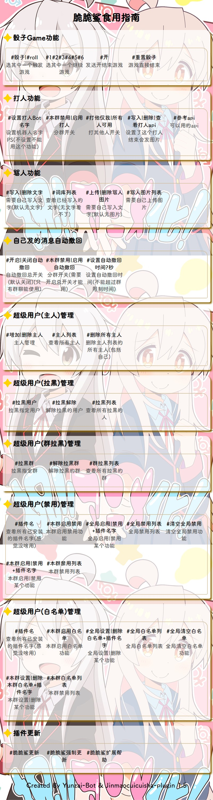
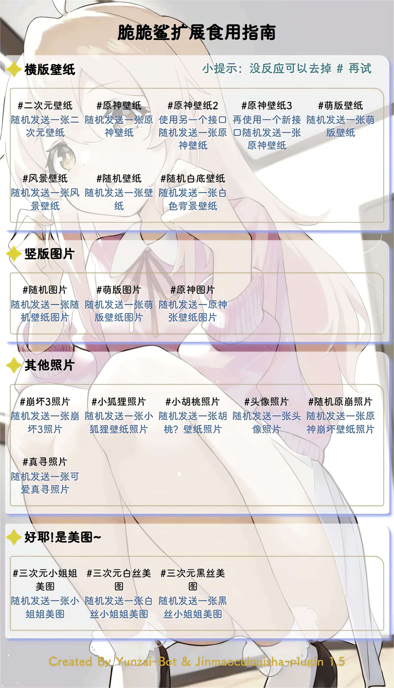

# 这里是插件使用指南~

 **插件使用指南** 

  
啦啦啦~

---

  
①帮助图：

- 脆脆鲨插件帮助图

 
    
	

---

  
②扩展帮助图：

- 有点懒先这样吧
- 脆脆鲨插件扩展帮助图

 
    
	

---

  
③娱乐类

|       打人功能       |      使用示例      |            介绍            |
| :--------------: | :------------: | :------------------------: |
|设置打人Bot名字|#设置打人Bot名字脆脆鲨|添加bot的名字 |
|本群【启用/禁用】打人|#本群启用打人|是否开启群内打人功能 |
|打他【仅我/所有人】可用|#打他所有人可用|主人不受限制|
|【写入/删除】打人api|#写入打人apihttp://www.dmoe.cc/random.php|添加api|
|查看打人api|#查看打人api|查看你的api|
|api参考|#api参考|查看找好的api 仅限群内使用|
|打他/打我|#打他@金毛脆脆鲨 |打他并禁言|

---

|       骰子功能       |      使用示例      |            介绍            |
| :--------------: | :------------: | :------------------------: |
|骰子/roll|#骰子|随机骰子游戏|
|重置骰子|#重置骰子|重置你的记录|
|一到六|#一到六|不知道|
|开|#开|开骰子|

---

|       骂人功能       |      使用示例      |            介绍            |
| :--------------: | :------------: | :------------------------: |
|【写入/删除】文字+内容|#写入文字哈？|添加骂人回复功能|
|词库列表|#词库列表|查看你写入的词库|
|【上传/删除】骂人图片|#上传骂人图片|添加骂人回复的图片|   
|骂人图片列表|#骂人图片列表|查看你写入的图片|   

---

|       壁纸功能       |      使用示例      |            介绍            |
| :--------------: | :------------: | :------------------------: |
|脆脆鲨扩展壁纸功能|#脆脆鲨扩展壁纸|查看一张壁纸壁纸图|

	

---

  
④管理类（绝对权限）

|       自动撤回功能（撤回一切？）       |      使用示例      |            介绍            |
| :--------------: | :------------: | :------------------------: |
|【开启/关闭】自动撤回|#开启自动撤回|是否开启群撤回|
|本群【启用/禁用】自动撤回|#本群启用自动撤回|是否开启群撤回 进限该群|
|设置自动撤回时间【时间】+秒|#设置自动撤回时间15秒|撤回时间|   

---
     
|       云崽主人管理       |      使用示例      |            介绍            |
| :--------------: | :------------: | :------------------------: |
|【增加/删除】主人|#增加主人123456789|添加删除主人|
|主人列表|#主人列表|查看bot的所有主人|
|删除所有主人|#删除所有主人|删除bot的全部主人|
|拉黑用户|#拉黑用户 @金毛脆脆鲨 |拉黑这个人|
|拉黑解除|#拉黑解除1|解除对这个人的拉黑（使用拉黑列表查看）|
|拉黑列表|#拉黑列表|查看拉黑的人| 
|拉黑群+群号|#拉黑群123456789|拉黑群| 
|解除拉黑群|#解除拉黑群123456789|解除对这个群的拉黑（使用群拉黑列表查看）|
|群拉黑列表|#群拉黑列表|查看拉黑的群|

---

|       云崽管理       |      使用示例      |            介绍            |
| :--------------: | :------------: | :------------------------: |
|插件名|#插件名|查看你安装的插件使用帮助|
|全局【禁用/启用】+功能名字|#全局禁用戳一戳 |停用这个功能|
|全局禁用列表|#全局禁用列表|查看你禁用的功能|
|清空全局禁用|#清空全局禁用|删除全部禁用的功能| 
|全局【设置/删除】白名单+插件名字|#设置白名单戳一戳|添加白名单| 
|白名单列表|#白名单列表|查看添加的白名单|
|清理白名单|#清理白名单|删除全部白名单|

---

# 这里是插件报错与问题~

 **插件问题/报错解决办法** 

  
哒哒哒~

---

  
①常见报错解决办法

 &nbsp;
 &nbsp;

> 1.从plugins中删除Jinmaocuicuisha-plugin重新下载脆脆鲨插件（适用于大多数情况）
> 
> 2.请查看你的崽是不是v3 脆脆鲨插件只支持v3
> 
> 3.如果是更新插件后报错了 请耐心等待会修复
> 
> 4.[`trss崽`](https://gitee.com/TimeRainStarSky/Yunzai)目前支持7个协议端 可能不谦融吧（没看过） 报错了与本插件无关不要来找
> 
> 5.Jinmaocuicuisha-plugin插件载入失败 请手动打开plugins文件找到脆脆鲨插件改成Jinmaocuicuisha-plugin
> 
> 如：&emsp; &emsp; &emsp; &emsp; &emsp; &emsp; &emsp; &emsp;  **注意大小写** 
>  
       

 

---

  
②插件冲突问题

 &nbsp;
 &nbsp;

> 1.脆脆鲨插件可能会与带有打人的插件产生冲突,如有发生冲突问题，删就对辣
> 
> 2.本插件与[互殴插件(fisticuffs plugin)](https://gitee.com/JK_An0nymou5/fisticuffs-plugin)会造成严重冲突，互殴插件是被这个作者叫为脆脆鲨二开的插件，出问题请找[互殴插件作者](https://gitee.com/JK_An0nymou5)

--- 

  
③关于脆脆鲨扩展功能的问题

 &nbsp;
 &nbsp;

> 1.脆脆鲨插件的扩展功能也就是壁纸功能
> 
> 2.壁纸功能为了减少内存占用使用的全部为api，所以会出现什么问题大家都知道吧！
> 
> 3.api用的是别人随时会寄na! 如果出现这个问题会及时解决哒！要是寄的太多就只能移除此功能了，或者将壁纸的功能缩减大半
> 
> 4.由于部分api图片有石粒是大大哒！所以发送会较慢，比如原神壁纸的一个api每张都是高清
> 
> 5.还是api问题，如果佬们有自己搭建的api要是愿意可以提供我们！

 

---