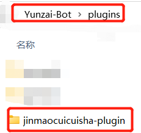

</div>
<div align="center">

# 脆脆鲨插件-jinmaocuicuisha

</div>


<p align="center">

</p>
[](https://gitee.com/JMCCS/jinmaocuicuisha.git)

#### 介绍

1.基于 [Yunzai-Bot V3](https://github.com/Le-niao/Yunzai-Bot) 的功能插件

2.QAQ抄的各位大佬的，感觉没啥用的样子

3.非常重要！非常重要！非常重要！使用本插件后请第一时间给机器人发 #设置绝对权限 (如果被别人设置了别人可以删除你主人权限然后添加自己权限使用你机器人的所有功能)

#### 安装教程

cd至云崽根目录再输入下面的内容

强烈推荐gitee下载
```
git clone https://gitee.com/JMCCS/jinmaocuicuisha.git ./plugins/Jinmaocuicuisha-plugin
```
github下载（可能更新不及时）
```
git clone https://github.com/xiaoyun123452/jinmaocuicuisha.git ./plugins/Jinmaocuicuisha-plugin
```
如果您下载的zip文件，请解压后把-master去掉放进plugins文件中
<br>
    
#### 使用说明

1. · `#脆脆鲨帮助` | 查看

#### 宣一下群
欢迎各位大佬萌新进群玩：`脆脆鲨群:` [657142904](https://jq.qq.com/?_wv=1027&k=PrOc8Qp4)


### 免责声明

1. 功能仅限内部交流与小范围使用，请勿将 `Yunzai-Bot` 及 `Jinmaocuicuisha-plugin` 用于任何以盈利为目的的场景；
2. 素材均来自于网络，仅供交流学习使用，如有侵权请联系，会立即删除。