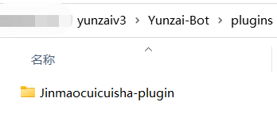
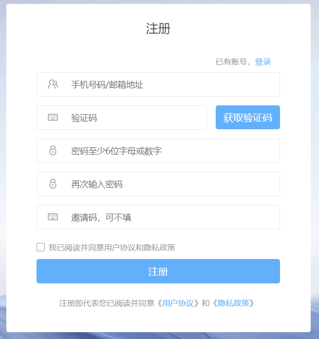
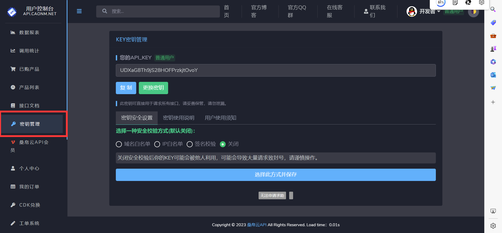

<div align="center">
  

  
<h1>Jinmaocuicuisha-plugin</h1>


# [脆脆鲨网页（首次访问加载时间较长）](https://xyccs.netlify.app)
脆脆鲨插件是一个Yunzai-Bot的扩展插件，给bot提供一些便携管理和一些娱乐功能


</div>
<div align="center">

[](https://gitee.com/JMCCS/jinmaocuicuisha/blob/master/Plugin%20version.md)
[](https://gitee.com/JMCCS)
[](https://gitee.com/SHIKEAIXY)
[](https://gitee.com/Le-niao/Yunzai-Bot)
<a href='https://gitee.com/JMCCS/jinmaocuicuisha/stargazers'></img></a>
<a href='https://gitee.com/JMCCS/jinmaocuicuisha/members'></img></a>

[](https://gitee.com/JMCCS/jinmaocuicuisha.git)

</div>


## 介绍

1.基于 [Yunzai-Bot V3](https://gitee.com/Le-niao/Yunzai-Bot) 的功能插件

2.脆脆鲨插件支持[时雨](https://gitee.com/TimeRainStarSky)的[go-cqhttp 版 Yunzai](https://gitee.com/TimeRainStarSky/Yunzai)

3.脆脆鲨插件仅支持 云崽v3 版本 v2版本 请勿下载

4.QAQ抄的各位大佬的，感觉没啥用的样子

5.在这里说一下在[`apps/UP.js`](https://gitee.com/JMCCS/jinmaocuicuisha/blob/master/apps/UP.js)中写了2个作者的[`更新权限`](https://gitee.com/JMCCS/jinmaocuicuisha/blob/master/resources/%E8%82%BE%E8%99%9A%E7%9A%84%E8%84%86%E8%84%86%E9%B2%A8/up%E6%9D%83%E9%99%90.png)可以自行删除

6.注意！注意！注意！安装本插件后请第一时间给机器人发 `#设置绝对权限`

  如果佬们 有什么问题请务必pr
<br>
    

---

## 安装教程

注意:一定要CD至云崽根目录再输入下面的内容

### gitee下载（强烈推荐）
```
git clone https://gitee.com/JMCCS/jinmaocuicuisha.git ./plugins/Jinmaocuicuisha-plugin
```
### github下载（可能更新不及时）
```
git clone https://github.com/SHIKEAIXY/Jinmaocuicuisha.git ./plugins/Jinmaocuicuisha-plugin
```
### zip下载（不推荐）

[点击此处下载](https://gitee.com/JMCCS/jinmaocuicuisha/repository/archive/master.zip)

下好后把-master去掉放进plugins文件中
<br>
    

---

## 功能介绍&报错解决

> Jinmaocuicuisha-plugin提供以下功能
> 详细内容请使用 **脆脆鲨帮助（第一次使用需先 #设置绝对权限 ）**  查看

| `功能介绍/报错解决`|
| ------------- |
|[点击此处查看脆脆鲨使用帮助](https://gitee.com/JMCCS/jinmaocuicuisha/blob/master/Plugin%20function.md)|

---
 
## 宣一下群
欢迎各位大佬萌新进群玩：`脆脆鲨群:` [657142904](https://jq.qq.com/?_wv=1027&k=PrOc8Qp4)

---

| `关于版本`|
| ------------- |
|[点击查看脆脆鲨版本](https://gitee.com/JMCCS/jinmaocuicuisha/blob/master/Plugin%20version.md)|

---

## 关于表情包制作

### api问题

- 1.表情包制作使用的第三方api 能用多久听从天命
- 2.部分（一两个）可能会有问题 发现了会及时解决

### key问题

- 1.此制作功能需要key才能用（已经填写过了）
- 2.这个key`完全免费` `完全免费` `完全免费`！ ！ ！
- 3.key用的自己的 有频率限制 强烈建议各位申请自己的（不然可能会出现裂图）

#### key申请教程

1.打开网站并登录

[点击此处打开 https://api.caonm.net/user/register ](https://api.caonm.net/user/register)
<br>
    

注册完成后登录即可

2.点击密钥管理然后进行获取key

<br>
    

获取完成替换掉原来`Emojis.js`中第4行的key 保存后重启机器人即可

## 免责声明

1. 功能仅限内部交流与小范围使用，请勿将 `Yunzai-Bot` 及 `Jinmaocuicuisha-plugin` 用于任何以盈利为目的的场景；
2. 素材均来自于网络，仅供交流学习使用，如有侵权请联系，会立即删除。
