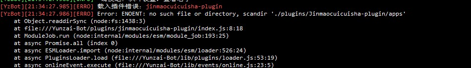

<div align="center">
  

  
<h1>Jinmaocuicuisha-plugin</h1>


脆脆鲨插件是一个Yunzai-Bot的扩展插件，给bot提供一些便携管理和一些娱乐功能


</div>
<div align="center">

<a href='https://gitee.com/JMCCS/jinmaocuicuisha/stargazers'></img></a>
<a href='https://gitee.com/JMCCS/jinmaocuicuisha/members'></img></a>

[](https://gitee.com/JMCCS/jinmaocuicuisha.git)

</div>

#### 介绍

1.基于 [Yunzai-Bot V3](https://gitee.com/yoimiya-kokomi/Yunzai-Bot) 的功能插件

2.脆脆鲨插件支持[时雨](https://gitee.com/TimeRainStarSky)的[go-cqhttp 版 Yunzai](https://gitee.com/TimeRainStarSky/Yunzai)

3.脆脆鲨插件仅支持云崽v3版本v2请勿下载

4.QAQ抄的各位大佬的，感觉没啥用的样子

5.注意！注意！注意！安装本插件后请第一时间给机器人发 `#设置绝对权限`

  如果佬们 有什么问题请务必pr
<br>
    

#### 安装教程

注意:一定要CD至云崽根目录再输入下面的内容

强烈推荐gitee下载
```
git clone https://gitee.com/JMCCS/jinmaocuicuisha.git ./plugins/Jinmaocuicuisha-plugin
```
github下载（可能更新不及时）
```
git clone https://github.com/xiaoyun123452/jinmaocuicuisha.git ./plugins/Jinmaocuicuisha-plugin
```
如果您下载的zip文件，请解压后把-master去掉放进plugins文件中
<br>
    

## 功能介绍

> Jinmaocuicuisha-plugin提供以下功能
> 详细内容请使用 **脆脆鲨帮助**  查看


<details>
  <summary>娱乐类</summary>

- 打人功能

    - 设置打人Bot名字

    - 本群【启用/禁用】打人
    
    - 打他【仅我/所有人】可用

    - 【写入/删除】打人api

    - api参考
    
    - 打他/打我
     
- 筛子功能

    - 筛子/roll

    - 重置筛子
    
    - 开
     
- 骂人功能

    - 【写入/删除】文字+内容

    - 词库列表
    
    - 【上传/删除】骂人图片 
    
    - 骂人图片列表 

<details>
  <summary>管理类（绝对权限）</summary>

- 自动撤回功能（撤回一切？）

    - 【开启/关闭】自动撤回    

    - 本群【启用/禁用】自动撤回
    
    - 设置自动撤回时间【时间】+秒
     
- 云崽主人管理

    - 拉黑用户

    - 拉黑解除

    - 拉黑列表
    
    - 拉黑群+群号

    - 解除拉黑群

    - 群拉黑列表

- 云崽管理

    - 全局【禁用/启用】+功能名字

    - 全局禁用列表

    - 清理全局禁用
    
    - 【设置/删除】白名单+功能

    - 白名单列表

    - 清理白名单

#### 使用说明

1. · 发送 `#脆脆鲨帮助` 查看脆脆鲨食用说明（第一次使用需先 #设置绝对权限 ）

#### 宣一下群
欢迎各位大佬萌新进群玩：`脆脆鲨群:` [657142904](https://jq.qq.com/?_wv=1027&k=PrOc8Qp4)

#### 插件报错解决方法
1.从plugins中删除Jinmaocuicuisha-plugin重新下载脆脆鲨插件（适用于大多数情况）

2.请查看你的崽是不是v3 脆脆鲨插件只支持v3

3.如果是更新插件后报错了 请耐心等待会修复

4.如果报错显示的不是Jinmaocuicuisha-plugin插件载入失败 请手动打开plugins文件找到脆脆鲨插件改成Jinmaocuicuisha-plugin
如：    图片来自群友
<br>
    

注意大小写

还是无法解决请加群发送后台截图进行询问


[云崽Bot问题点击此处跳转查看解决问题](https://www.wolai.com/bVJh7bXVrubjDyioVf9mmR)
 


### 免责声明

1. 功能仅限内部交流与小范围使用，请勿将 `Yunzai-Bot` 及 `Jinmaocuicuisha-plugin` 用于任何以盈利为目的的场景；
2. 素材均来自于网络，仅供交流学习使用，如有侵权请联系，会立即删除。
