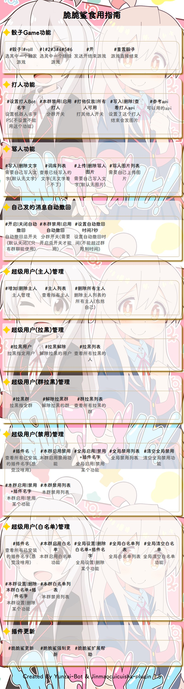

# 脆脆鲨插件 使用介绍
## 点击下方展开即可查看

  
帮助图：

- 脆脆鲨插件帮助图

 
    
	

  
娱乐类

|       打人功能名称       |      使用示例      |            介绍            |
| :--------------: | :------------: | :------------------------: |
|设置打人Bot名字|#设置打人Bot名字脆脆鲨|添加bot的名字 |
|本群【启用/禁用】打人|#本群启用打人|是否开启群内打人功能 |
|打他【仅我/所有人】可用|#打他所有人可用|主人不受限制|
|【写入/删除】打人api|#写入打人apihttp://www.dmoe.cc/random.php|添加api|
|查看打人api|#查看打人api|查看你的api|
|api参考|#api参考|查看找好的api 仅限群内使用|
|打他/打我|#打他@金毛脆脆鲨 |打他并禁言|

- 筛子功能

    - 筛子/roll

    - 重置筛子
    
    - 开
     
- 骂人功能

    - 【写入/删除】文字+内容

    - 词库列表
    
    - 【上传/删除】骂人图片 
    
    - 骂人图片列表 
	

  
管理类（绝对权限）

- 自动撤回功能（撤回一切？）

    - 【开启/关闭】自动撤回    

    - 本群【启用/禁用】自动撤回
    
    - 设置自动撤回时间【时间】+秒
     
- 云崽主人管理

    - 拉黑用户

    - 拉黑解除

    - 拉黑列表
    
    - 拉黑群+群号

    - 解除拉黑群

    - 群拉黑列表

- 云崽管理

    - 全局【禁用/启用】+功能名字

    - 全局禁用列表

    - 清理全局禁用
    
    - 【设置/删除】白名单+功能

    - 白名单列表

    - 清理白名单

